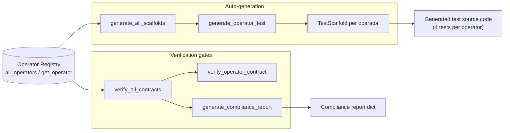
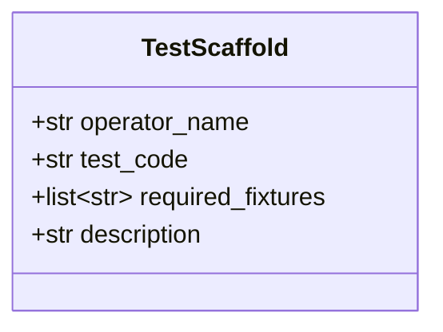
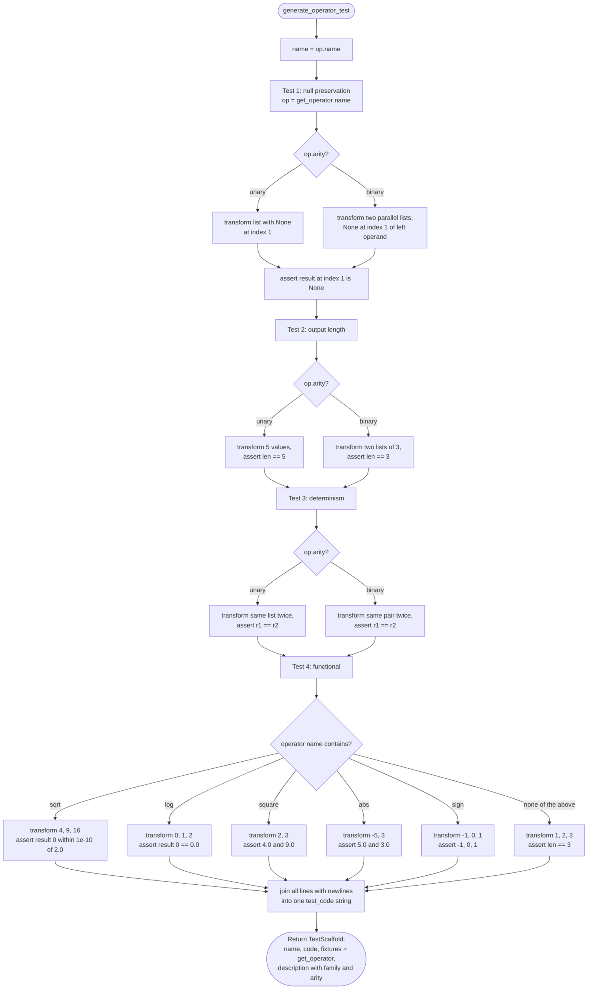
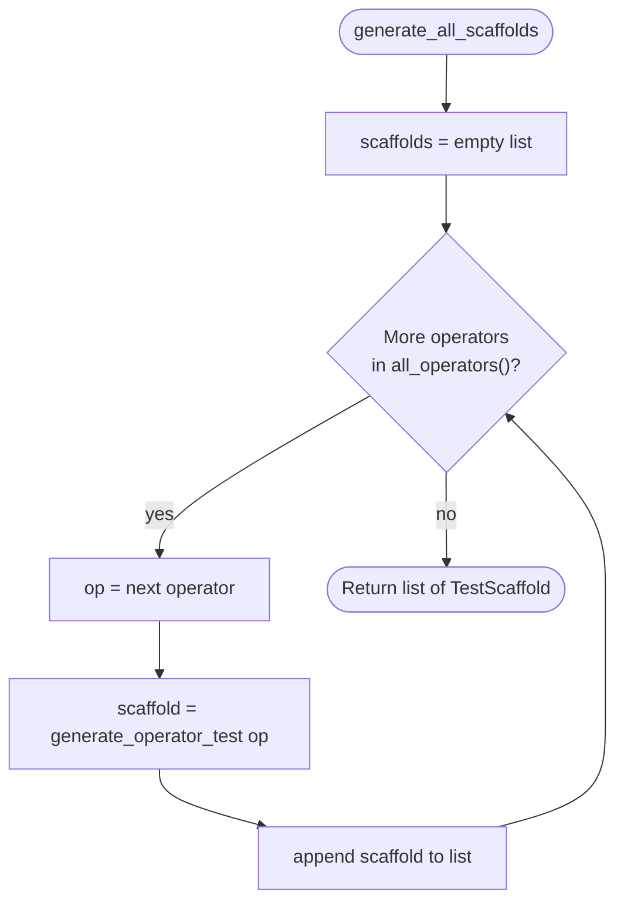
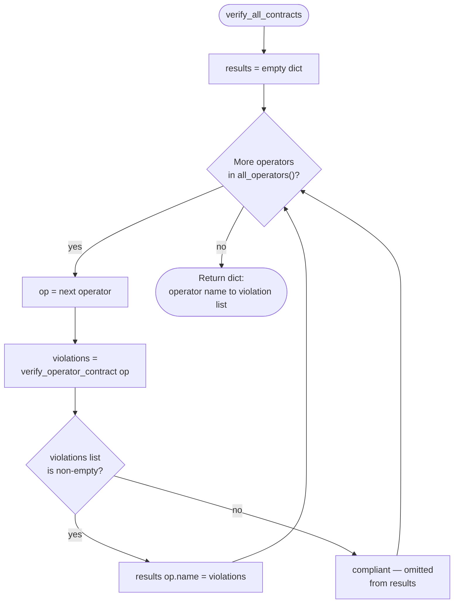
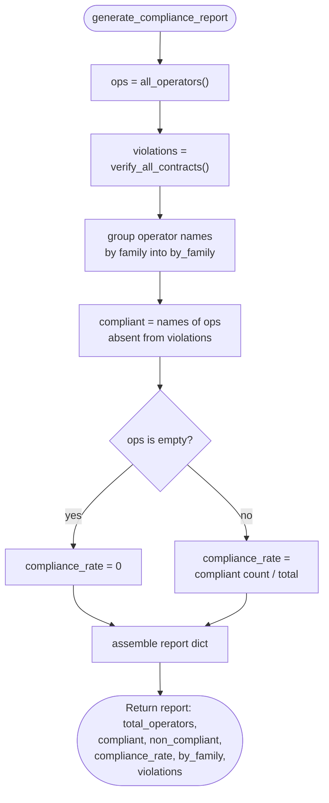

# Module Overview

This module implements **doc 09's "Auto-generation" and "Verification gates"** for a feature-engineering operator system. It has two responsibilities:

1. **Auto-generation** — given the operator registry, emit pytest-style test code so every operator gets baseline contract tests without hand-writing them.
2. **Verification** — statically check that each registered operator satisfies its metadata contract (defined in doc 05), and aggregate results into a compliance report.



Note the complementary split: `verify_*` functions are **static** (inspect metadata, never call `transform`), while the generated tests are **behavioral** (actually execute `transform`).

---

## 1. `TestScaffold` (dataclass)

A plain value object that carries one operator's generated test code. No behavior — just a transport container.

| Field | Meaning |
|---|---|
| `operator_name` | Name of the operator the tests target |
| `test_code` | The generated Python source code as a single string |
| `required_fixtures` | Fixtures the code needs — always `["get_operator"]` |
| `description` | Human-readable summary including family and arity |



---

## 2. `generate_operator_test(op)`

**Purpose:** Build a Python source string containing **four test functions** for a single operator:

1. **Null preservation** — `None` in → `None` out at the same index
2. **Output length** — `len(output) == len(input)`
3. **Determinism** — same input twice → identical output
4. **Functional correctness** — expected values, chosen by **name substring** (`sqrt`, `log`, `square`, `abs`, `sign`, else a length-only smoke test)

Each test body branches on **arity** (unary gets one list; binary gets two parallel lists) and fetches the operator via `get_operator(name)` rather than importing it directly. Note `{{len(result)}}` in the f-string — doubled braces so the *generated* code contains a real f-string.

**Example output** for a unary operator named `sqrt`:

```python
def test_sqrt_null_preservation():
    """Verify null in -> null out for sqrt."""
    op = get_operator("sqrt")
    result = op.transform([1.0, None, 3.0])
    assert result[1] is None, "null not preserved"

def test_sqrt_output_length():
    """Verify output length matches input length for sqrt."""
    op = get_operator("sqrt")
    result = op.transform([1.0, 2.0, 3.0, 4.0, 5.0])
    assert len(result) == 5, f"expected 5, got {len(result)}"

def test_sqrt_deterministic():
    """Verify same input -> same output for sqrt."""
    op = get_operator("sqrt")
    r1 = op.transform([1.0, 2.0, 3.0])
    r2 = op.transform([1.0, 2.0, 3.0])
    assert r1 == r2, "non-deterministic output"

def test_sqrt_functional():
    """Basic functional test for sqrt."""
    op = get_operator("sqrt")
    result = op.transform([4.0, 9.0, 16.0])
    assert abs(result[0] - 2.0) < 1e-10
```



---

## 3. `generate_all_scaffolds()`

**Purpose:** Simple fan-out — iterate every registered operator and delegate to `generate_operator_test`. Returns the full list of scaffolds.



---

## 4. `verify_operator_contract(op)`

**Purpose:** Static contract validation per doc 05. Returns a **list of violations** — empty means compliant. Checks are independent `if`s (not fail-fast), so **all** problems are collected.

| # | Check | Violation if... |
|---|---|---|
| 1 | Required metadata | Any of `name`, `family`, `purpose`, `cost_shape`, `generation_trigger`, `validation` is empty |
| 2 | Transform | `op.transform` is not callable |
| 3 | Arity consistency | `unary` but `input_types` ≠ 1 entry, or `binary` but ≠ 2 entries |
| 4 | Leakage rule (L1/L2) | Fit-dependent operator has `fit_scope == "none"` — it must declare how it fits |
| 5 | Leakage rule (L0) | Stateless operator has `target_permission != "P0_no_target"` — it must not touch the target |

```mermaid
flowchart TD
    A([verify_operator_contract]) --> B["violations = empty list"]

    B --> C{"All six required fields set?<br/>name, family, purpose, cost_shape,<br/>generation_trigger, validation"}
    C -->|"one or more missing"| D["append one violation<br/>per missing field"]
    C -->|"all set"| E{"transform is callable?"}
    D --> E

    E -->|"no"| F["append: transform is not callable"]
    E -->|"yes"| G{"arity == unary?"}
    F --> G

    G -->|"yes"| H{"input_types has<br/>exactly 1 entry?"}
    H -->|"no"| I["append: unary operator has<br/>N input_types"]
    H -->|"yes"| J{"arity == binary?"}
    G -->|"no"| J
    I --> J

    J -->|"yes"| K{"input_types has<br/>exactly 2 entries?"}
    K -->|"no"| L["append: binary operator has<br/>N input_types"]
    K -->|"yes"| M{"leakage class is L1 or L2?"}
    J -->|"no"| M
    L --> M

    M -->|"yes"| N{"fit_scope == none?"}
    N -->|"yes"| O["append: L1/L2 operator<br/>has fit_scope = none"]
    N -->|"no"| P{"leakage class == L0?"}
    M -->|"no"| P
    O --> P

    P -->|"yes"| Q{"target_permission<br/>!= P0_no_target?"}
    Q -->|"yes"| R["append: L0 operator has<br/>non-P0 target_permission"]
    Q -->|"no"| S([Return violations list<br/>empty list = compliant])
    P -->|"no"| S
    R --> S
```



---

## 5. `verify_all_contracts()`

**Purpose:** Fan-out + filter. Verifies every operator, but **only records failures** — compliant operators are implicitly absent from the result. Returns `{operator_name: [violations, ...]}`.



---

## 6. `generate_compliance_report()`

**Purpose:** Aggregate everything into a single summary dict — the "verification gate" output. Combines registry enumeration, contract verification, and per-family grouping, with a guard against division by zero for an empty registry.

**Example output:**

```python
{
    "total_operators": 12,
    "compliant": 11,
    "non_compliant": 1,
    "compliance_rate": 0.9166,
    "by_family": {"arithmetic": 5, "transform": 4, "interaction": 3},
    "violations": {"ratio": ["L1 operator has fit_scope=none"]},
}
```



---

## Key observations

- **Two-layer gating:** static metadata checks (`verify_*`) catch declaration errors immediately; generated behavioral tests catch runtime contract violations (null handling, length, determinism) when the scaffolds are executed.
- **Substring dispatch is heuristic:** any name containing `"log"` gets the `log1p` expectation, `"sqrt"` wins over `"log"` if both appear, etc. Ordering matters.
- **Binary null test only probes the left operand** — `None` in the right operand list isn't covered by the scaffold.
- **`verify_all_contracts` is failure-only** by design, which keeps the compliance report's `violations` section focused; the compliant count is derived by set difference.