# Module Overview

This module implements the **doc 09 "Compiler steps" / "Verification loop"** as a pipeline of discrete gates that run against a frozen `PipelineIR`, plus an exporter that packages the compiled pipeline as a standalone sklearn project. Two distinct halves:

1. **Verification gates** — 10 gate functions (covering steps 1–7, 16, 18, 19, 21 of the 22-step loop) that each return a `VerificationResult`.
2. **Orchestration & export** — `compile_pipeline` runs all gates and assembles a `CompilerReport`; `generate_sklearn_project` emits a file dict for a deployable project.

Every gate shares the same **timing envelope**:

```python
t0 = time.monotonic()
... work ...
dt = (time.monotonic() - t0) * 1000      # milliseconds
return VerificationResult(..., duration_ms=dt)
```

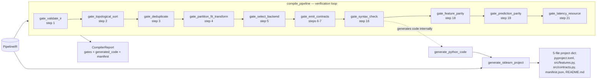

| Gate | Doc 09 step | Pass criterion | Can fail? |
|---|---|---|---|
| `gate_validate_ir` | 1 | `ir.verify_dag()` returns no errors | Yes |
| `gate_topological_sort` | 2 | topo order covers every node | Yes |
| `gate_deduplicate` | 3 | — | No (always passes) |
| `gate_partition_fit_transform` | 4 | — | No (always passes) |
| `gate_select_backend` | 5 | — | No (always passes) |
| `gate_emit_contracts` | 6–7 | every input is `raw:*` or an existing node | Yes |
| `gate_syntax_check` | 16 | generated code compiles | Yes |
| `gate_feature_parity` | 18 | every expected feature exists in IR | Yes |
| `gate_prediction_parity` | 19 | `class_mapping` is a dict; threshold ∈ [0, 1] | Yes |
| `gate_latency_resource` | 21 | node count and estimated latency within limits | Yes |

Steps **8–15, 17, 20, 22** (test emission, benchmarks, packaging, etc.) are not implemented here — per the docstring, they "happen at the integration boundary."

---

## 1. `VerificationResult` (dataclass)

Value object for one gate's outcome. Sensible defaults (`message=""`, `details={}` via `default_factory`, `duration_ms=0.0`) so minimal results are easy to construct.

| Field | Meaning |
|---|---|
| `gate_name` | Which gate produced this result |
| `passed` | Outcome flag |
| `message` | Human-readable summary or joined error list |
| `details` | Structured extras (node ids, orders, backend lists…) |
| `duration_ms` | Gate execution time from the timing envelope |

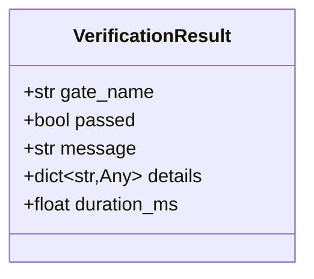

---

## 2. `CompilerReport` (dataclass)

Accumulates gate results plus the compilation artifacts. `all_passed` starts `True` and is only ever driven to `False` — a **sticky** aggregate.

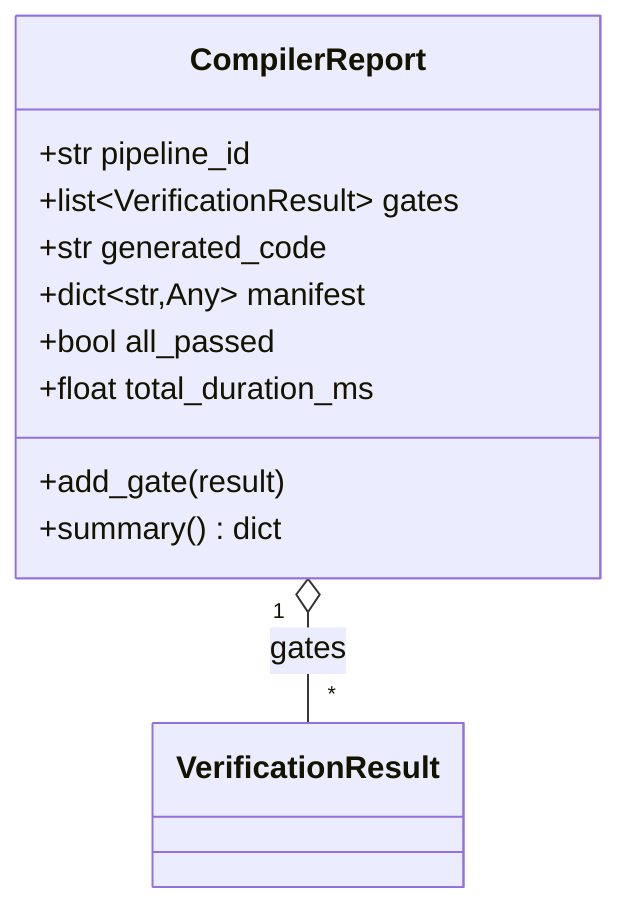

### `add_gate(result)`

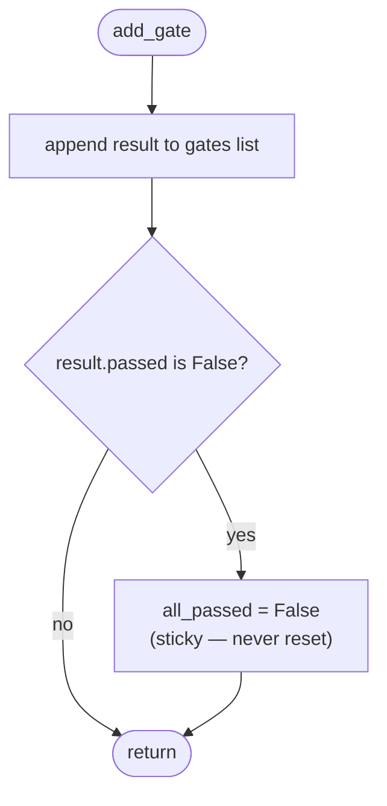

### `summary()`

Single-pass counts over `gates` using generator expressions:

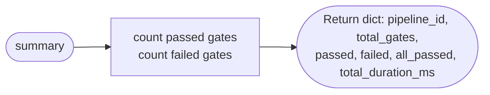

---

## 3. `gate_validate_ir(ir)` — Step 1

Delegates entirely to `ir.verify_dag()`; the gate is a thin wrapper that converts an error list into a pass/fail with the errors joined by semicolons as the message. Assumes `verify_dag()` returns a list rather than raising.

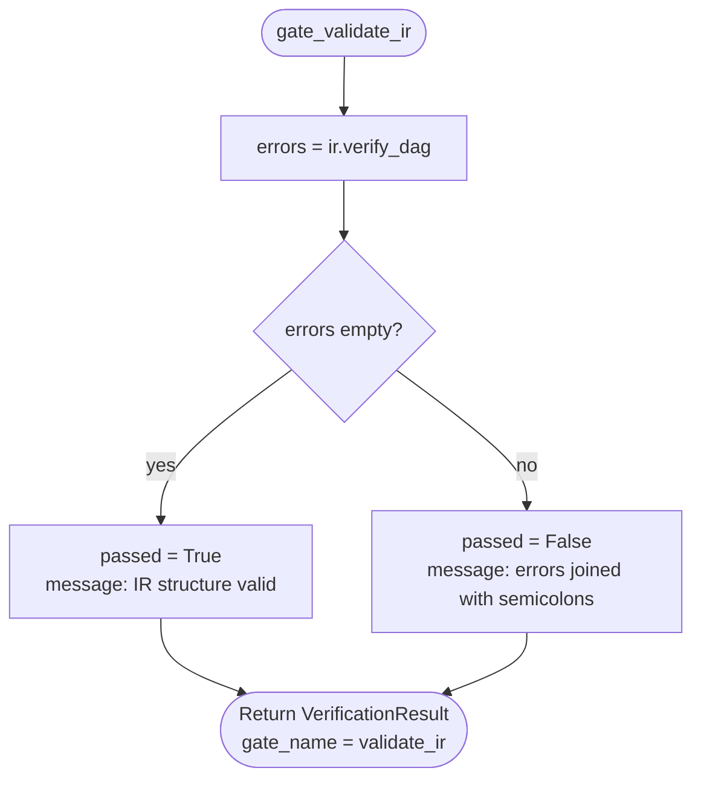

---

## 4. `gate_topological_sort(ir)` — Step 2

Calls `ir.topological_order()` and checks **coverage**: the sorted order must contain exactly as many nodes as the IR. A shortfall implies a cycle or unreachable node (assuming the method returns a partial list rather than raising on cycles).

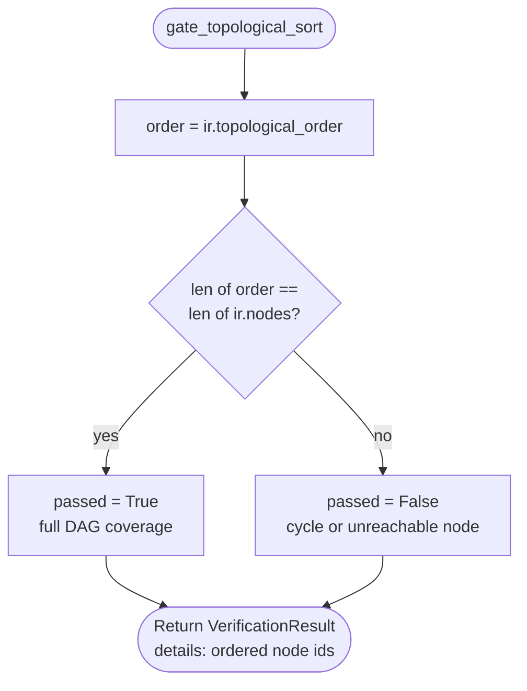

---

## 5. `gate_deduplicate(ir)` — Step 3

Builds a **structural fingerprint** per node:

```
h = f"{node.operator}:{tuple(sorted(node.inputs))}:{tuple(sorted(node.params.items()))}"
```

- Order-insensitive: same operator + same *set* of inputs + same *set* of params ⇒ same hash.
- **First occurrence wins**; later nodes with an identical hash are flagged in `duplicates`.
- The gate **always passes** — duplicates are recorded in `details`, not treated as a failure. (The actual merge presumably happens in a later compiler step not implemented here.)

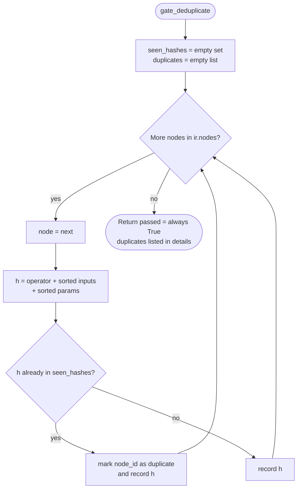

---

## 6. `gate_partition_fit_transform(ir)` — Step 4

Splits nodes by `fit_scope` to separate **fit-time state** (must be learned on training data) from **transform-time state** (stateless). Informational — always passes.

⚠️ **Edge case:** a node whose `fit_scope` is *not* one of `"training_fold"`, `"development"`, or `"none"` falls into **neither** bucket — the two counts may not sum to `len(ir.nodes)`, and such nodes are silently unaccounted for.

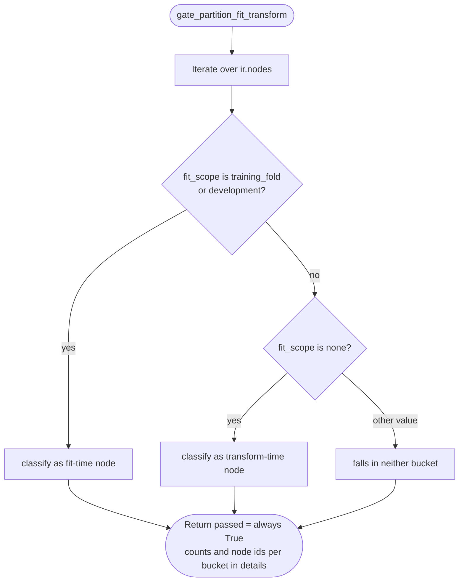

---

## 7. `gate_select_backend(ir)` + `_select_backend(node)` — Step 5

Maps each node to an implementation backend via a hardcoded operator set. Seven operators go to **sklearn** (`pca`, `truncated_svd`, `text_svd`, `kmeans_label`, `kmeans_distances`, `tfidf_word`, `tfidf_char`); everything else is **numpy**. The gate aggregates the distinct backend set — informational, always passes.

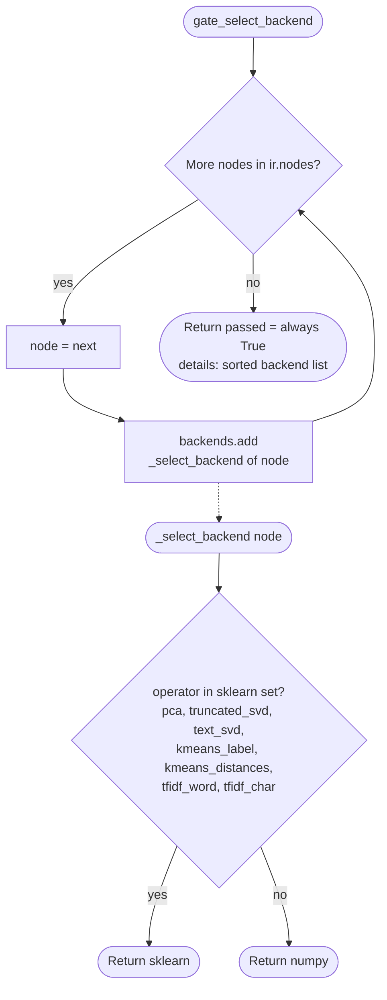

---

## 8. `gate_emit_contracts(ir)` — Steps 6–7

Validates that every node's inputs are resolvable. An input is legal iff it **starts with `"raw:"`** (a raw source column) **or** `ir.get_node(inp)` finds it (a derived feature reference). All errors are collected (not fail-fast) as `"node_id: missing input inp"` strings.

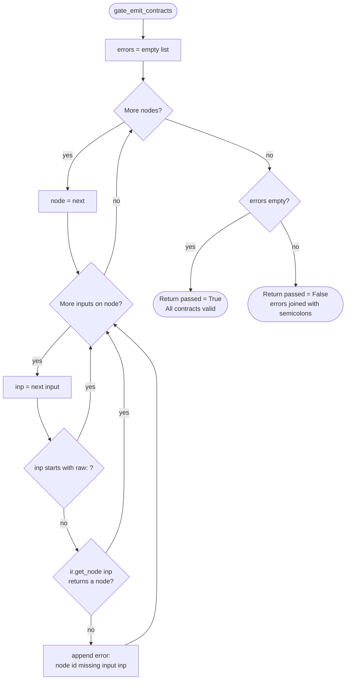

---

## 9. `gate_feature_parity(ir, expected_features, tolerance)` — Step 18

⚠️ **This is a structural stub.** The docstring describes full parity checking (identity, dtype, row alignment, null mask, numeric tolerance), but the implementation only verifies that each expected feature's `node_id` **exists in the IR**. Empty value lists are skipped; no values are compared, and `tolerance` is accepted but **never used**. The real value comparison happens at the integration boundary.

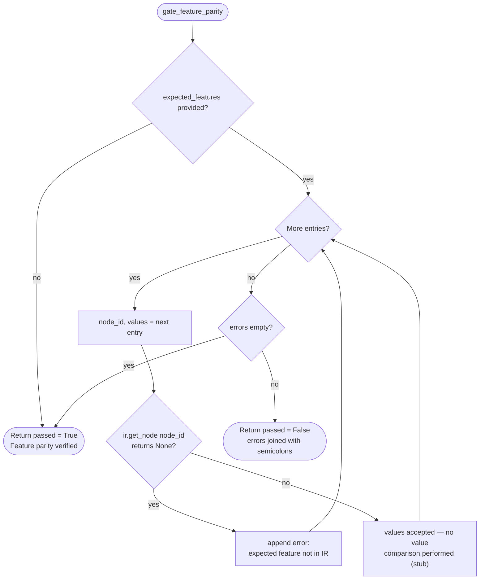

---

## 10. `gate_prediction_parity(ir, expected_predictions, tolerance)` — Step 19

Another **structural check** rather than a true parity test. Only two keys of `expected_predictions` are inspected:

- `"class_mapping"` → must be a `dict`
- `"threshold"` → must be within `[0.0, 1.0]`

All other keys are **silently ignored**, and `tolerance` is unused. Note that if both checks fail, only the **last** failure message survives (message is overwritten, not appended).

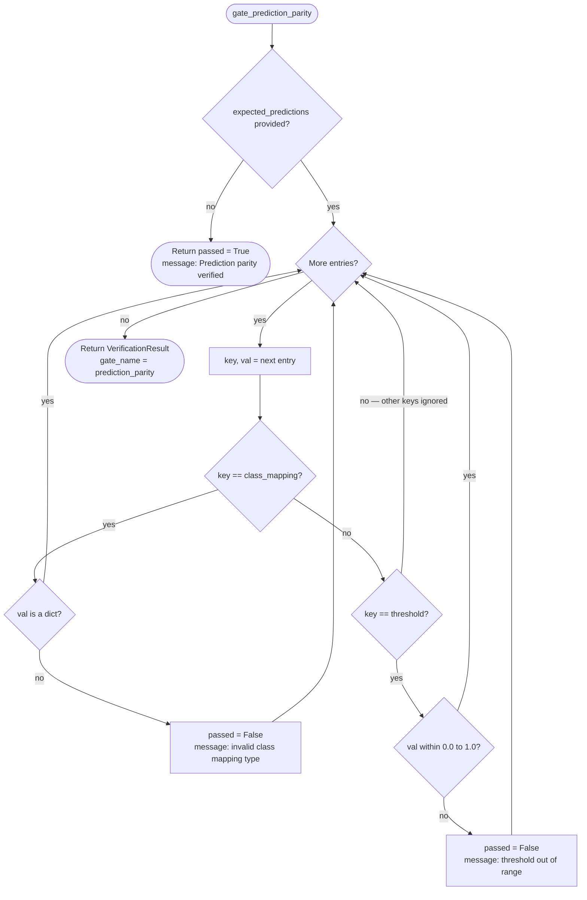

---

## 11. `gate_latency_resource(ir, max_latency_ms, max_nodes)` — Step 21

A **cheap static estimate**, not a benchmark: `estimated_ms = n_nodes × 0.5`. Passes iff both `n_nodes ≤ max_nodes` and `estimated_ms ≤ max_latency_ms`.

⚠️ With defaults, the node cap is always the binding constraint: 500 nodes × 0.5 ms = **250 ms ≪ 5000 ms**. The latency limit can only fail if configured below roughly `n_nodes × 0.5`.

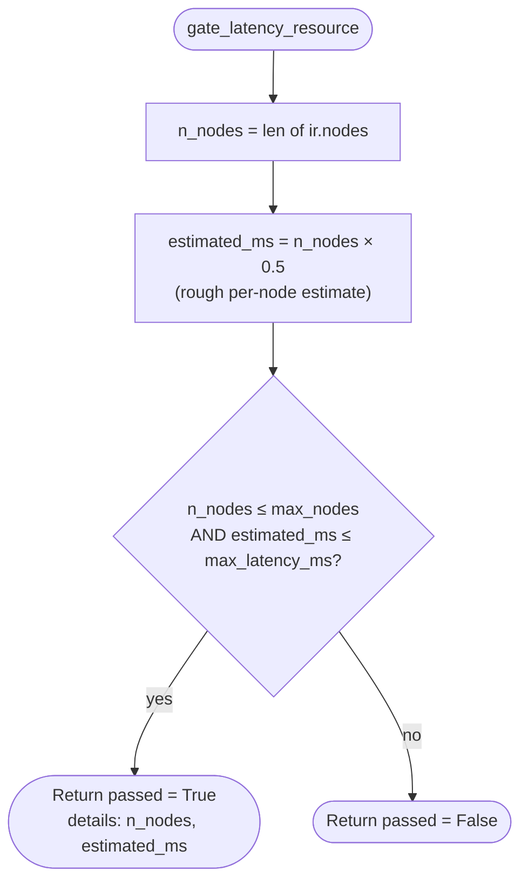

---

## 12. `gate_syntax_check(ir)` — Step 16

Generates the pipeline's Python code, then runs the builtin `compile(code, "<pipeline_ir>", "exec")`. This **parses and byte-compiles without executing**, so it catches syntax errors but *not* missing imports or runtime errors (e.g., sklearn availability is unverified until execution). Only `SyntaxError` is caught.

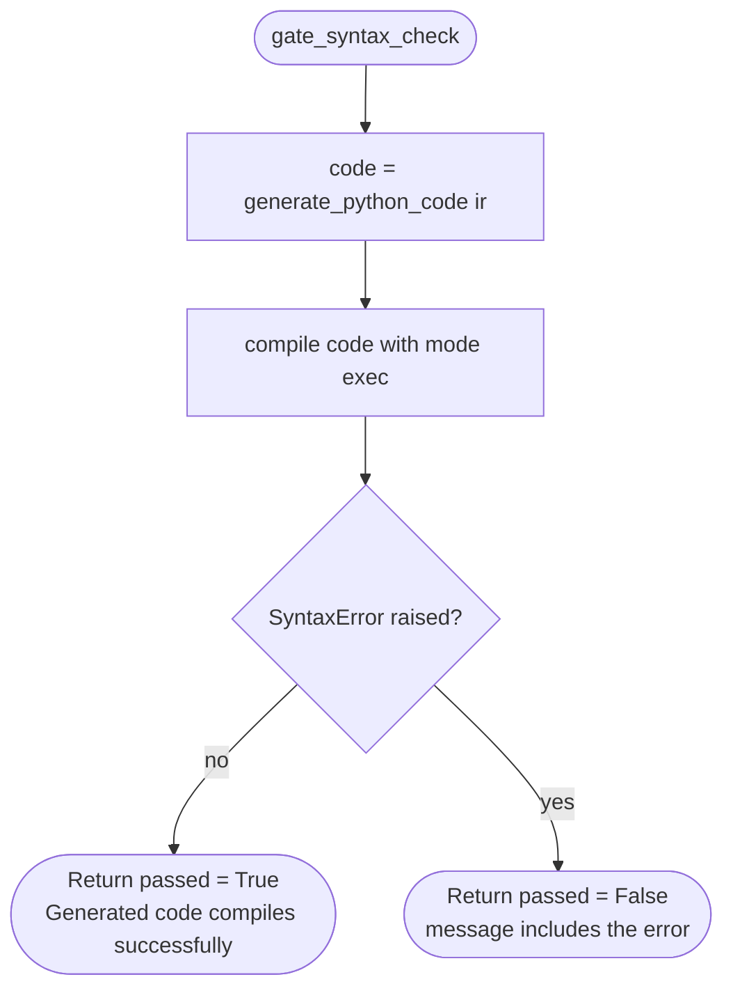

---

## 13. `compile_pipeline(ir, expected_features, expected_predictions)`

The orchestrator. Creates a `CompilerReport` and runs all ten gates in **fixed order** (matching the step numbering: 1–5, 6–7, 16, 18, 19, 21). Key behaviors:

- **Non-blocking:** every gate runs even if an earlier one failed; failures only flip `all_passed`.
- **Code is generated twice** — once inside `gate_syntax_check`, then again for `report.generated_code`.
- The **manifest** records `pipeline_hash` (via `ir.compute_hash()`), node/output counts, and gate tallies.
- Total duration measured around the whole loop, independent of per-gate timings.

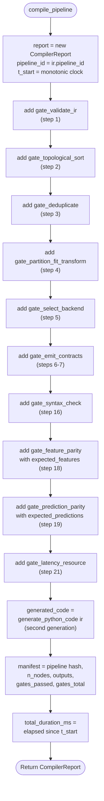

---

## 14. `generate_sklearn_project(ir, output_dir)`

Emits a **5-file project** as a `{relative_path: content}` dict — the caller is responsible for writing it to disk. Contents:

| File | Content |
|---|---|
| `pyproject.toml` | setuptools build config; project `fiae-export` 1.0.0; deps `scikit-learn>=1.3`, `numpy>=1.24` |
| `src/features.py` | The compiled pipeline (`generate_python_code(ir)`) |
| `src/contracts.py` | `InputSchema` (column → dtype) and `OutputSchema` dataclasses |
| `artifacts/manifest.json` | Provenance: pipeline hash, source fingerprint, target, task, node/output counts |
| `README.md` | Pipeline metadata + `apply_pipeline` usage snippet |

⚠️ The `output_dir` parameter is **accepted but unused** — paths are always relative.

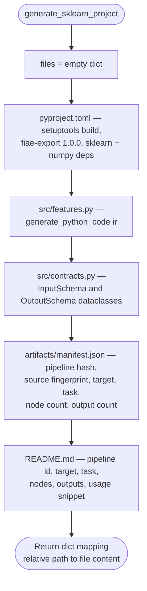

The resulting project layout:

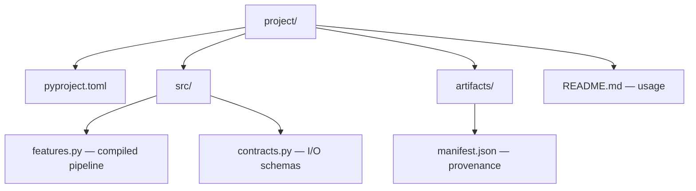

---

## Key observations

- **Partial step coverage:** only steps 1–7, 16, 18, 19, 21 of the 22-step loop exist here; steps 8–15, 17, 20, 22 (test emission, benchmarks, packaging) are deferred to the integration boundary.
- **Three gates can never fail** (`deduplicate`, `partition_fit_transform`, `select_backend`) — they're informational passes that enrich `details`.
- **Parity gates are stubs:** their docstrings describe full value-level comparison, but the implementations only do structural checks; both `tolerance` parameters are dead.
- **Gates are non-blocking and `all_passed` is sticky** — one failure anywhere permanently marks the report.
- **Redundant code generation:** `generate_python_code` runs up to twice per compile (inside `syntax_check` and for the report).
- **Partition blind spot:** unknown `fit_scope` values land in neither the fit nor transform bucket, so counts can silently under-total.
- **Latency check is dormant at defaults:** the node cap (500 → 250 ms) binds long before the 5000 ms latency limit.
- **Minor hygiene:** `output_dir` is unused in the exporter, and `FeatureNode`, `new_id`, and `Optional` are imported but never referenced.