# Module Overview

This module defines the **PipelineIR** — the serializable DAG that sits at the center of the doc 09 / doc 14 / FR-014 design. It is the *single source of truth* from which everything else is derived: the compiler's verification gates (previous module) call `verify_dag`, `topological_order`, `compute_hash`, and `generate_python_code` on it; the exporter serializes it into the sklearn project.

Three responsibilities:

1. **Structure** — `IRNode` + `PipelineIR` dataclasses with round-trip serialization
2. **Graph algorithms** — topological ordering, DAG verification, deterministic hashing
3. **Construction & codegen** — building the IR from proposals and emitting standalone Python

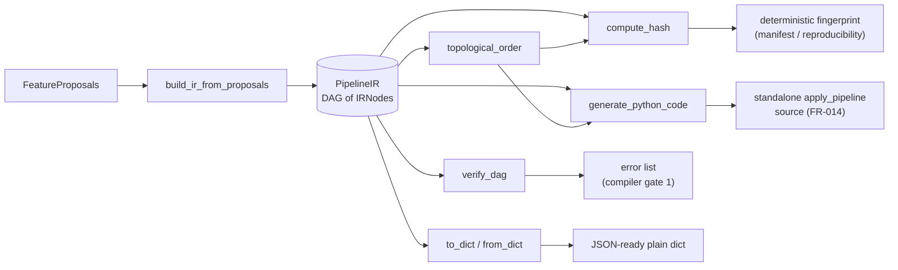

| Function | Kind | Purpose |
|---|---|---|
| `IRNode.to_dict` / `from_dict` | ser/des | Node-level round-trip |
| `PipelineIR.__post_init__` | lifecycle | Auto-assign pipeline id |
| `add_node` / `get_node` | structure | Append / linear-scan lookup |
| `topological_order` | graph | DFS post-order, dependencies first |
| `verify_dag` | graph | Missing-dep check + Kahn's cycle detection |
| `compute_hash` | reproducibility | Content fingerprint of the IR |
| `PipelineIR.to_dict` / `from_dict` | ser/des | Pipeline-level round-trip |
| `build_ir_from_proposals` | construction | Proposals → nodes |
| `generate_python_code` | codegen | IR → standalone Python (FR-014) |

---

## 1. `IRNode` (dataclass)

One vertex of the DAG. `inputs` holds either **node_ids** (derived features) or **`raw:`-prefixed** source column references — the same convention `verify_dag`, `topological_order`, and the code generator all key off. `params` and `metadata` use `default_factory=dict` (no shared mutable defaults).

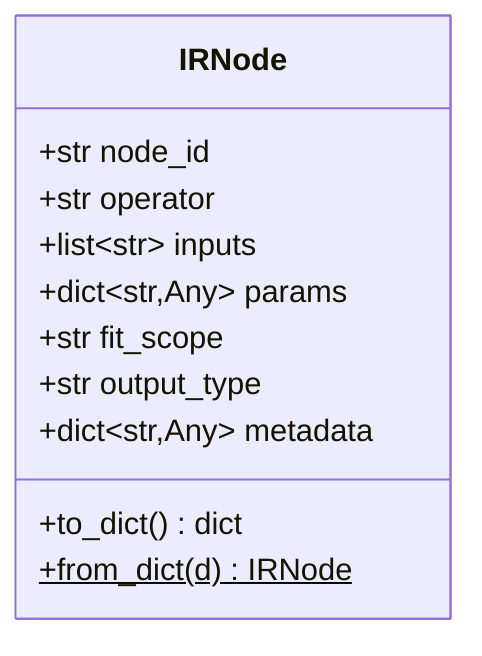

### `to_dict()` / `from_dict(d)`

`to_dict` delegates to `asdict()` — a **deep, dataclass-aware** conversion (nested dataclasses inside `params`/`metadata` also become plain dicts). `from_dict` is the tolerant inverse: it **filters keys against `__dataclass_fields__`**, so dicts carrying extra/unknown keys (e.g., from a newer schema version) deserialize cleanly instead of raising `TypeError`.

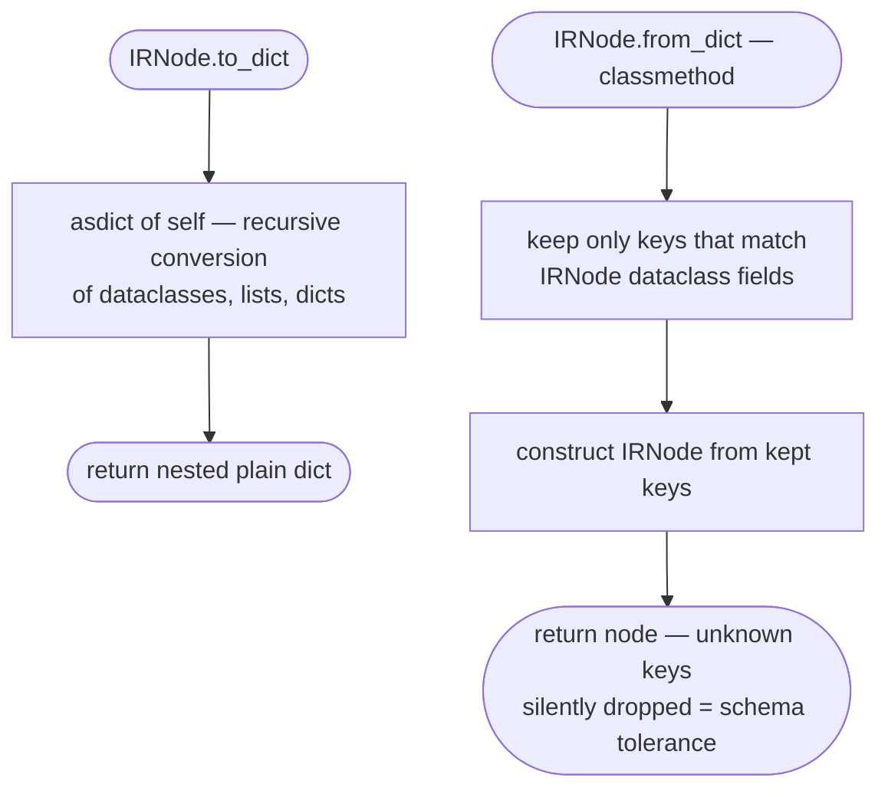

---

## 2. `PipelineIR` (dataclass)

The full pipeline: identity fields (`pipeline_id`, `version`, `source_fingerprint`), problem framing (`target`, `task`), the node list, and `outputs` — the node_ids of the **final** features.

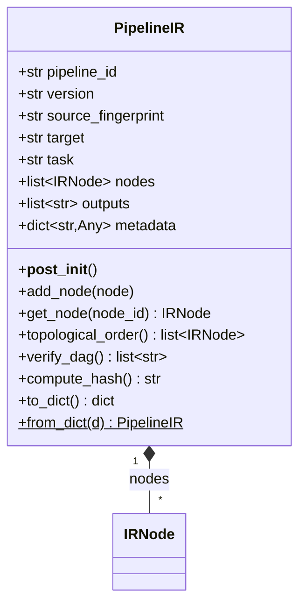

### `__post_init__()`

Identity bootstrap: an empty `pipeline_id` gets replaced with `new_id("pipe")`. This makes `PipelineIR()` a fresh pipeline while `from_dict` round-trips preserve the original id (since `to_dict` always writes a non-empty one).

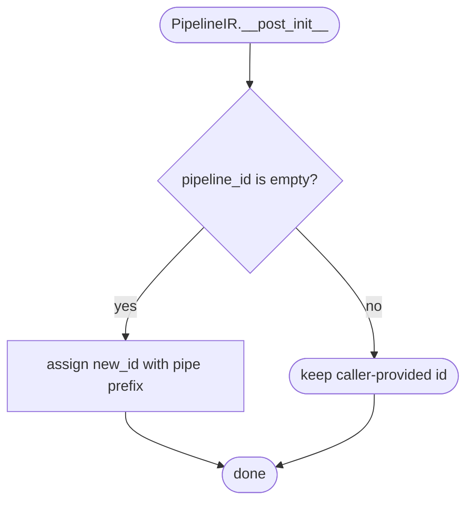

### `add_node(node)` / `get_node(node_id)`

`add_node` is a bare **append** — no duplicate-id check, no DAG check (those live in `verify_dag`). `get_node` is an **O(n) linear scan** returning the first match or `None`. Consequence: `topological_order` (which calls `get_node` per visit) is quadratic-ish in the worst case — fine at the ≤500-node scale enforced by the compiler's latency gate.

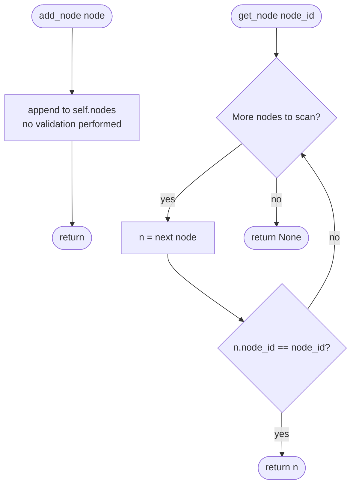

### `topological_order()`

Recursive **DFS post-order**: a node is appended only after all its non-`raw:` inputs have been visited. Two deliberate design choices:

- **Mark-on-entry** (`visited.add` *before* recursing) — this makes the recursion **cycle-safe**: a cycle terminates instead of recursing forever. But the resulting order for a cyclic graph does *not* respect dependencies; `verify_dag` is the real guard.
- **Dangling references are skipped** — `_visit` on a missing node_id marks it visited and returns, so a broken input doesn't crash ordering (it surfaces later as a `verify_dag` error).

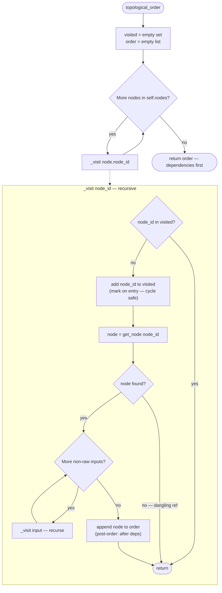

### `verify_dag()`

Two **independent phases**, all errors collected (not fail-fast):

1. **Dependency resolution** — every non-`raw:` input must exist as a node_id.
2. **Kahn's algorithm** — build in-degree/adjacency (only for inputs that are known node_ids; `raw:` and missing deps are naturally excluded), drain zero-in-degree nodes FIFO, and if the visited count ≠ node count, a cycle exists. Self-loops are caught correctly (in-degree never reaches zero).

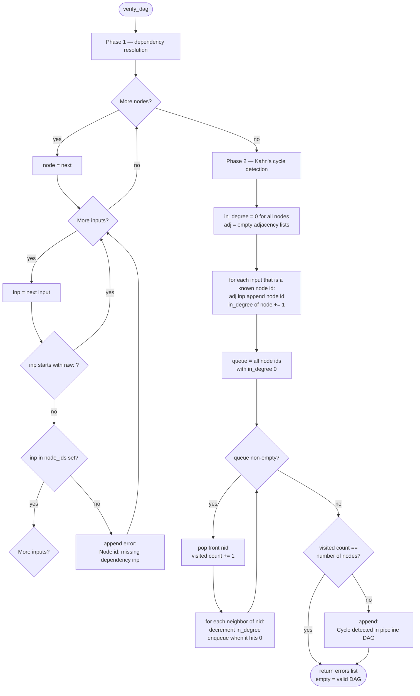

### `compute_hash()`

Fingerprints the IR for reproducibility (feeds the export manifest). It hashes nodes **in topological order** plus `sorted(outputs)` — so the output *set* is order-insensitive. Two caveats:

- The topo order itself depends on **node insertion order**, so this is a fingerprint of *this exact construction*, not a canonical graph-isomorphism hash — two semantically identical pipelines built in different orders hash differently (as do renumbered node_ids, which are included in `to_dict`).
- `params`/`metadata` dicts are serialized as-is; if `content_hash` doesn't sort dict keys, **insertion order of params** leaks into the hash.

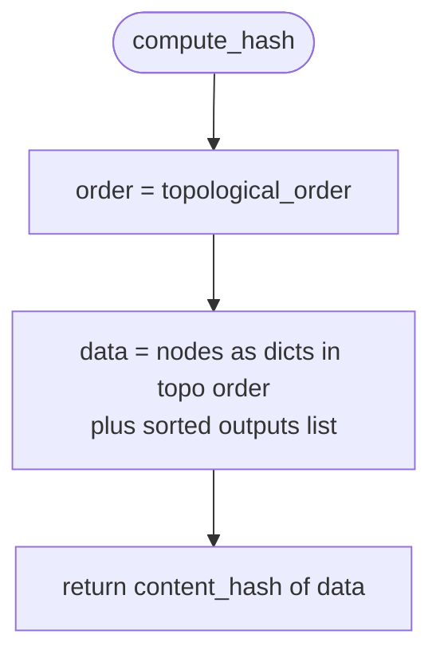

### `to_dict()` / `from_dict(d)`

`to_dict` emits a flat dict with nodes converted via `IRNode.to_dict` (in **insertion order**, unlike `compute_hash`). `from_dict` is fully default-tolerant (`d.get` with fallbacks for every field); an absent/empty `pipeline_id` triggers a fresh id via `__post_init__`.

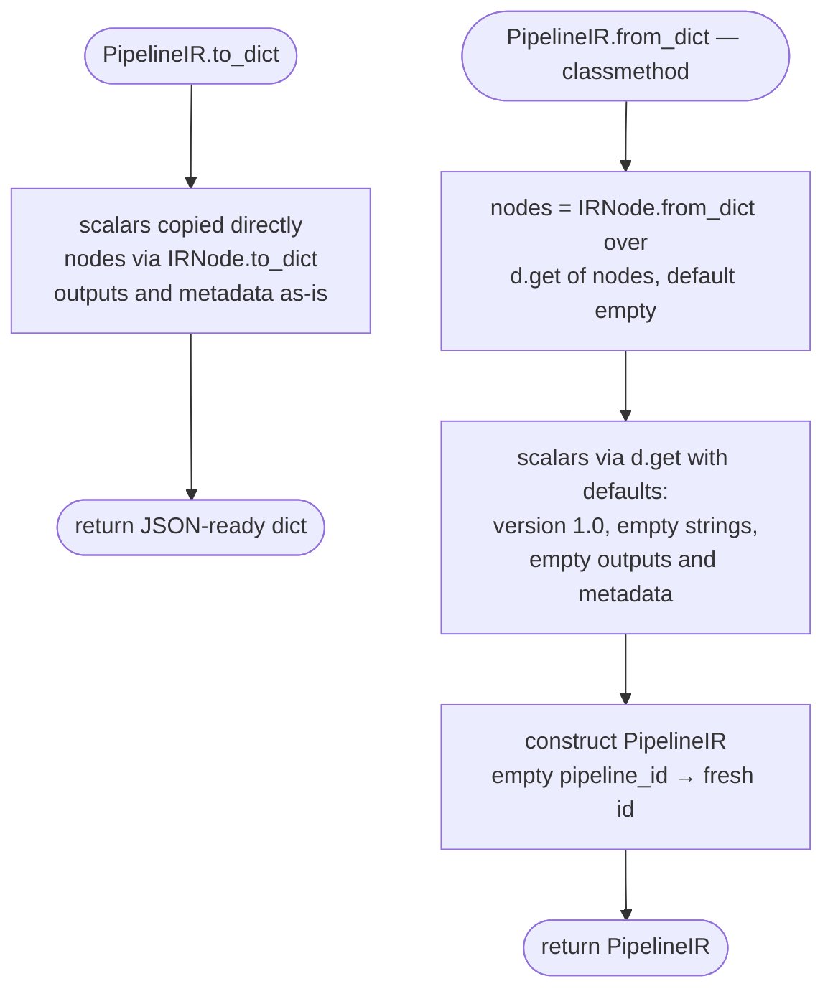

---

## 3. `build_ir_from_proposals(proposals, ...)`

Converts a proposal list into IR nodes. Key mechanics:

- **Sequential ids** `n_0, n_1, …` via a counter.
- **Input remapping:** `raw:` fids pass through; a fid found in `seen` is replaced by the producing node's id; anything else passes through **verbatim** (a dangling reference that `verify_dag` will later flag).
- The `seen` dict is keyed by the **signature** `operator(joined_inputs)` — so remapping only fires when a downstream proposal's input fid literally matches a prior node's signature.
- ⚠️ **No actual deduplication** — every proposal creates a new node even if identical (duplicates are merely *detected* later by the compiler's `gate_deduplicate`). Despite the name, `seen` only enables input wiring.
- ⚠️ **Every node is appended to `outputs`**, and `fit_scope`/`output_type`/`metadata` are left at defaults — proposal-level leakage metadata is **not carried into the IR**.

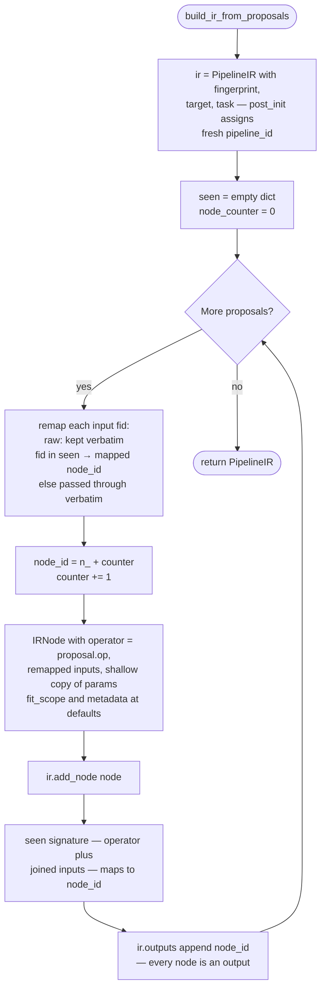

---

## 4. `generate_python_code(ir)`

The FR-014 core: derive **standalone** Python (only `import math`, no FIAE dependency) from the IR. Emits `apply_pipeline(data)`, walks nodes in topological order, and closes with a dict comprehension filtering to `ir.outputs`.

**Input mapping rule:** `raw:col` → `data.get('col', [])`; node ref → `outputs.get('node_id', [])` — the `.get` default silently yields `[]` when an upstream node was omitted.

### Dispatch table

| Operator | Arity guard | Generated behavior |
|---|---|---|
| `sqrt` | exactly 1 input | `math.sqrt(v)` if not None and `v >= 0`, else None |
| `log1p` | exactly 1 | `math.log1p(v)` if not None and `v >= -1.0`, else None |
| `abs` | exactly 1 | `abs(v)` if not None, else None |
| `square`, `cbrt`, `sign`, `reciprocal`, `exp_clip` | exactly 1 | **passthrough** (comment only — unimplemented) |
| *any of the 8 unary ops* | **≠ 1 input** | **nothing emitted — node silently omitted** |
| `sum` / `difference` / `product` | exactly 2 | zip elementwise, None-pair guard |
| `zero_indicator` | ≥ 1 | `v == 0.0` indicator, None-preserving |
| `missing_indicator` | ≥ 1 | `v is None` (booleans, always defined) |
| `identity` | ≥ 1 | direct assignment (**aliases** the source list) |
| anything else | ≥ 1 | generic passthrough of first input; **0 inputs → generation-time `IndexError`** |

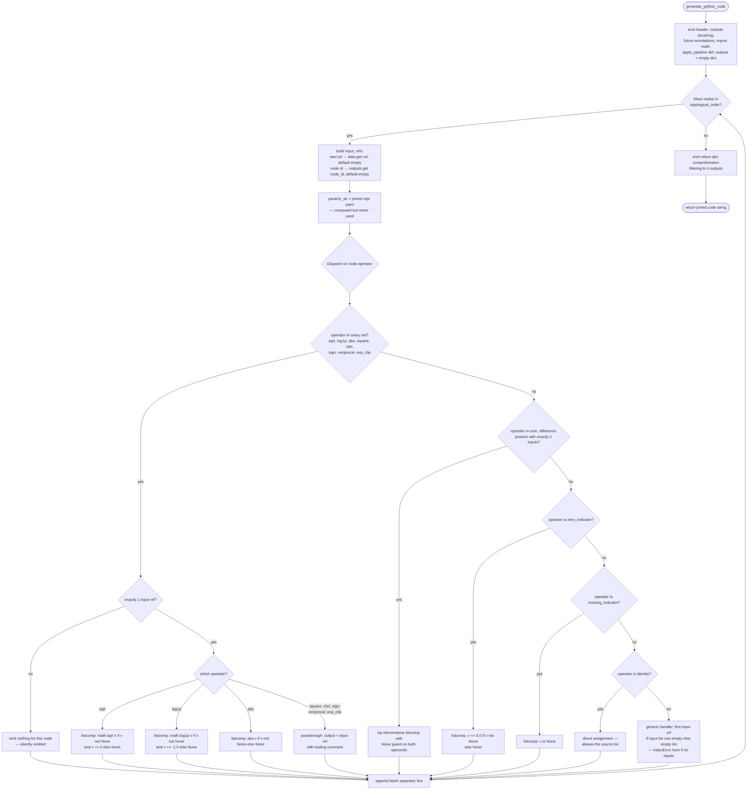

### Example

For a 2-node IR — `n_0 = sqrt(raw:x)`, `n_1 = sum(n_0, raw:y)`, `outputs = [n_1]`:

```python
"""Auto-generated feature pipeline."""
from __future__ import annotations
import math


def apply_pipeline(data: dict[str, list]) -> dict[str, list]:
    """Apply the feature pipeline to input data."""
    outputs = {}

    # sqrt(raw:x)
    _vals = data.get("x", [])
    outputs["n_0"] = [
        math.sqrt(v) if v is not None and v >= 0 else None
        for v in _vals
    ]

    # sum(n_0, raw:y)
    _a, _b = outputs.get("n_0", []), data.get("y", [])
    outputs["n_1"] = [
        (x + y if x is not None and y is not None else None)
        for x, y in zip(_a, _b)
    ]

    return {k: outputs[k] for k in outputs if k in [
        "n_1",
    ]}
```

---

## Key observations

- **`params_str` is dead code** — built from `node.params` on every node, never referenced. Node parameters currently have **no effect** on generated code (e.g., a `sum` node with custom params is indistinguishable from a default one).
- **Silent omission hazard:** a unary-set operator with ≠1 input emits *nothing*; the node's key never appears in `outputs`, and every downstream `outputs.get(..., [])` masks the omission as an empty list rather than failing loudly.
- **Codegen coverage is partial:** only `sqrt`, `log1p`, `abs` (unary) and `sum`/`difference`/`product` (binary) produce real math; the other five unary names are accepted-but-passthrough. Binary ops with ≠2 inputs degrade to the generic handler.
- **Generation-time crash path:** every non-unary-set branch indexes `input_refs[0]` — a node with zero inputs raises `IndexError` *while building the f-string*, before any code is produced.
- **Aliasing:** `identity`, passthrough, and the generic handler assign the **same list object** that `data`/`outputs` hold — a mutation of one aliases the other.
- **`zip` truncates** to the shorter operand; the generated code performs no length-parity check (the compiler's generated tests cover that instead).
- **Cycle strategy is split:** `topological_order` is cycle-*tolerant* (mark-on-entry prevents infinite recursion but yields a dependency-violating order), while `verify_dag` is the authoritative cycle *detector* — the pipeline relies on running the gate first.
- **Hash determinism ≠ canonicity:** `compute_hash` is stable for a given construction, but sensitive to node insertion order, node_id numbering, and (depending on `content_hash`) params key order.
- **`build_ir_from_proposals` is lossy:** fit/leakage metadata from proposals never reaches the IR, every node becomes an output, and true dedup is deferred to the compiler's `gate_deduplicate`.
- **Hygiene:** `hashlib`, `json`, `FeatureNode`, `FitScope`, and `TargetPermission` are imported but unused; `queue.pop(0)` makes Kahn's O(V²) in the worst case (harmless at the ≤500-node budget).